# Pre

横向 + 纵向结合

Define: 
- [引用信息]
- (给自己看的内容)

画图澄清思路

# 引入(< 5 min)

> 那是不知在何处、不知何时就存在的地方

> 在那里，人和精灵(其实是妖精)、鬼、妖怪等等不可思议的事物共存着

> 拥有众多力量，和不同目的的少女们，艰难摸索着来到了此处

> 温柔地包容着各种奇迹的那片大地…… 

> 它的名字是 ——

> “幻想乡” ......

(出自:[夜降り萃梦郷 ~ A Reverie of Dolls and Stellula](https://y.music.163.com/m/song?id=393858&uct=hWTVV82q2bU0EVvxZhm7IQ%3D%3D&dlt=0846&app_version=8.8.23&sc=wmv&tn=))

(可以截取部分音乐)

(点出"东方" 和 "幻想乡"的概念)

听了前面那段诗一般的文字里，我不知道大家会有什么样的感受。

就我个人而言，在我初次听到这段歌词的时候，它带我走向了這美麗的世界，"幻想乡"，在随后空灵的 bgm 柔和以及主唱人声当中，我彷彿進入了一個美好的夢境，不能自拔。而东方 project , 便是这一切幻想故事的起源。(ppt 转场)

东方 project 你可能不知道是什么，但你一定或多或少遇到以下这些经典的场景:

你是否见过这样集体狂欢的景象 ?
[b站镇站的东方视频]

你是否在不经意间听到一些耳熟的 bgm ?
[央视中出现的东方音乐]

你是否在做题的时候突然遇见一些奇怪的题目背景?
[Luogu上的东方题目]

没错，它们似乎都指向同一个相同的源头: 东方Project。 

它有着华丽的弹幕，也有着大量精美的同人创作，更衍生了许多耳熟能详的旋律。其发展了 20 余年，粉丝遍布全球，二次创作作品数不胜数，诸多知名游戏公司的主创团队也创作过相关作品，甚至世界一流大学如明治大学、乃至北京大学也曾邀请作者出席动漫文化高端讲座。

东方究竟是什么? 东方为什么会火 ? (抛问题)

下面，我将先粗略讲讲，东方到底是什么。(转场动画)

# 什么是东方(< 10min)

## 官方

(纵深式 时间顺序交代 + 平板式列举特点)
(介绍 + 现象列举 + 图片素材)

东方 Project (日语：東方プロジェクト・とうほうぷろじぇくと，英语：Touhou Project，Project Shrine Maiden) ，简称东方，或称东方系列，是日本的同人社团 "上海爱丽丝幻乐团" (实际只有太田顺也一人，一般称作ZUN) 所制作的一系列以弹幕射击游戏为主的游戏 (Shooting Game)。第一部官方正作《东方红魔乡》于 2002 年发布，此后的25年间，ZUN 始终以一定频率持续发布新作品，至今为止已有 26 部官方游戏。

游戏的主线剧情大致是...

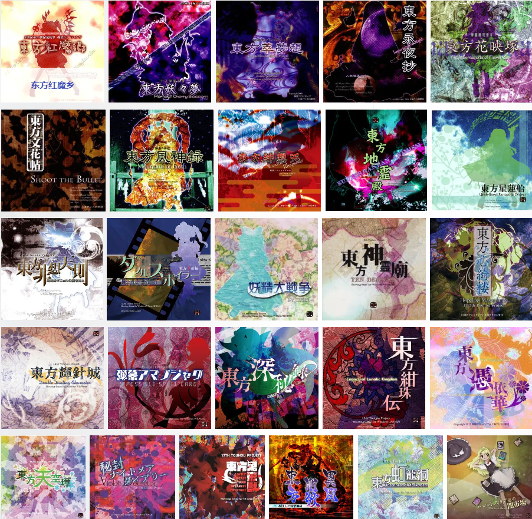

既然作为 "幻乐团" ，自然是少不了音乐作品。迄今为止，ZUN以“ZUN's Music Collection”这个名字一共发布了11张专辑。每个专辑都包含再编曲的旧曲目，以及新的原创曲目。每个专辑都包含由ZUN所亲自编写的附赠“故事”。

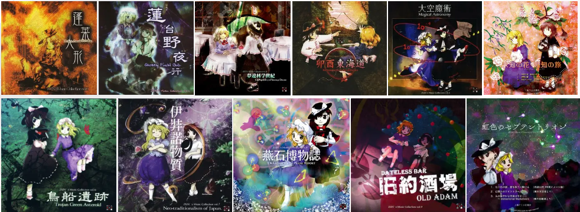

除此之外，东方 Project 官方也发布有的非游戏载体的作品（基本为商业作品），以书籍、漫画、小说、杂志等为主。

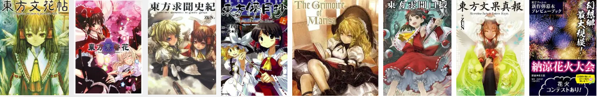

## 二次创作以及其他社群

然而，当我们提及 "东方 Project" 这一个概念的时候，我们更多的时候并不仅仅想要指代的是 "上海爱丽丝幻乐团" 所制作的一系列同人游戏、相关作品。从前面放出的一些片段我们也不难看出，东方 Project 最出名恐怕并不是官方作品本身，而个更多的是由爱好者基于原作而进行的二次创作。

事实上，以东方二次创作为核心建立的社群，其规模和影响力已然不输官方作品，具备相当强大的影响力。其表现形式包括但不限于

- 同人音乐
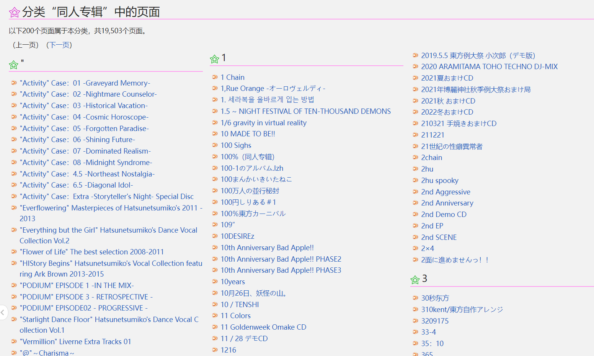
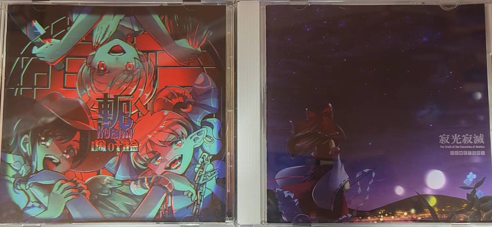

(我手头的两张)
体量庞大、种类繁多的同人音乐作品正是东方 Project 非常具有特色的一点。由上图中，我们不难看出，东方同人音乐有巨大的体量，截止 2023 年 3 月，仅 wiki 上收录的专辑就有 19503 张，总曲数高达 158624 首。假如按照一首曲子平均时长 3:40 计算，大家数学都很好，可以算算连续不断地听，总共需要多久能听完。(403天)

- 同人绘画
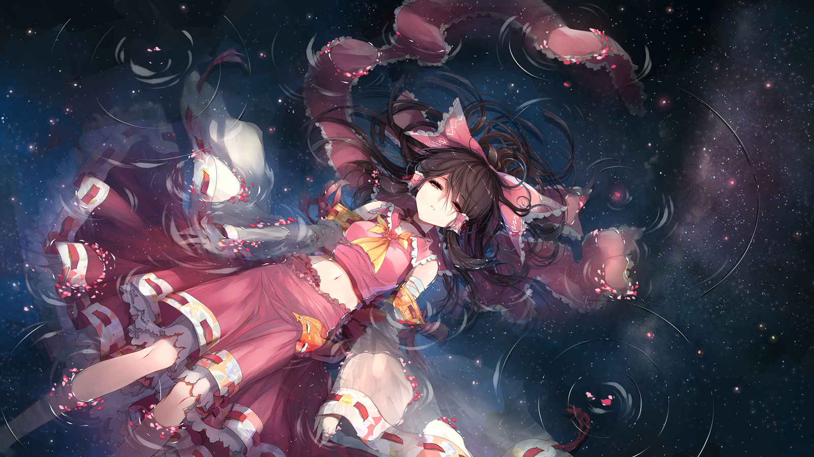

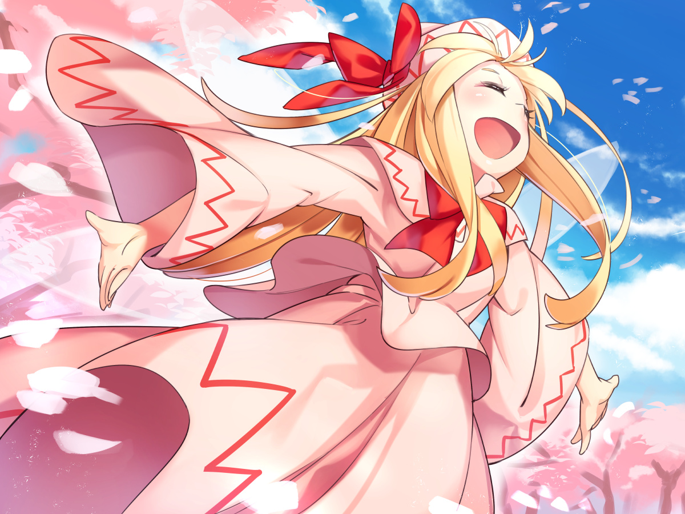
东方的同人绘画也是非常的出名。由于东方的角色众多，特征鲜明，加上无数画师挥毫泼墨，创作出了风格各异、独具特色的作品，以至于

- 同人视频

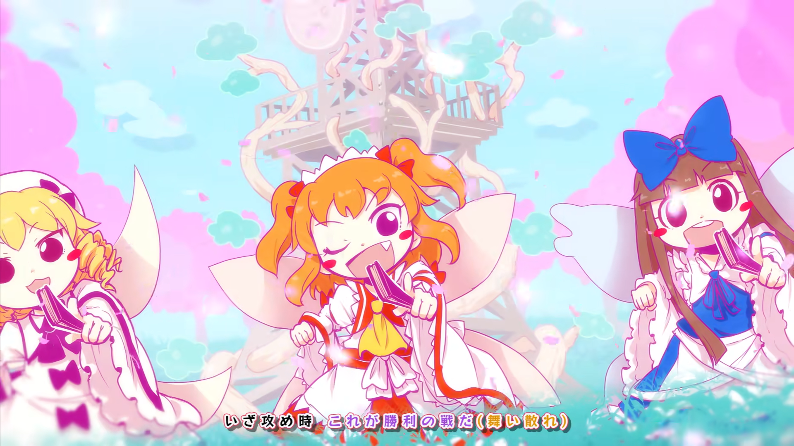
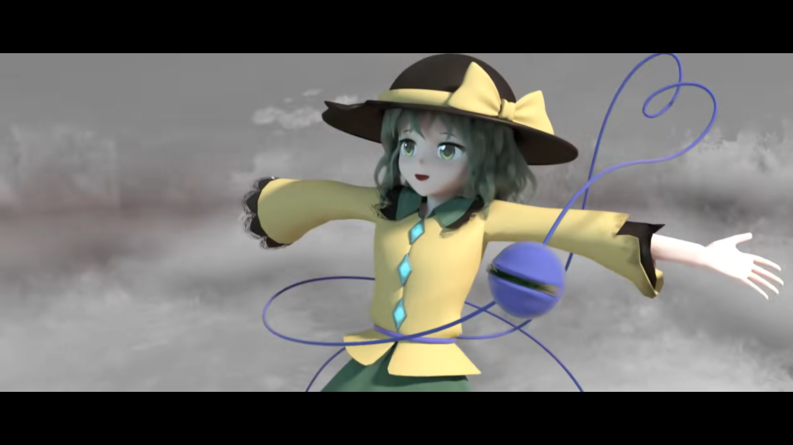
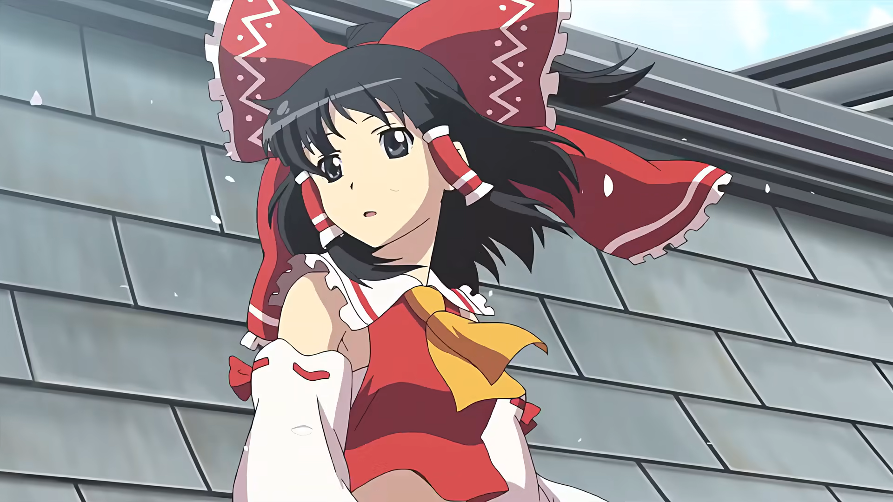
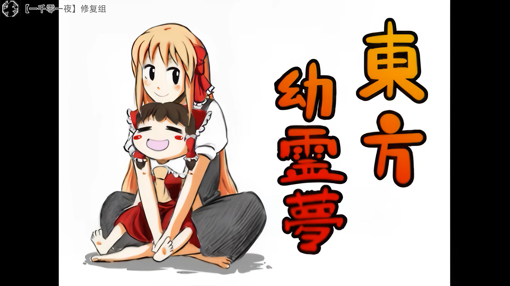

- 同人游戏
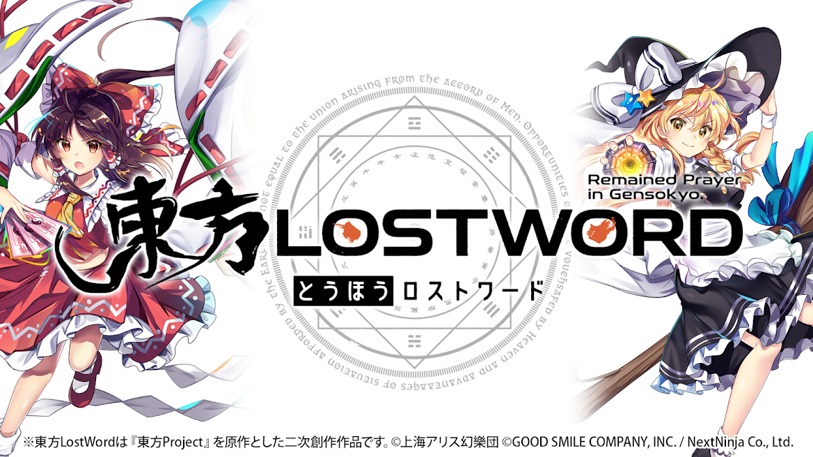
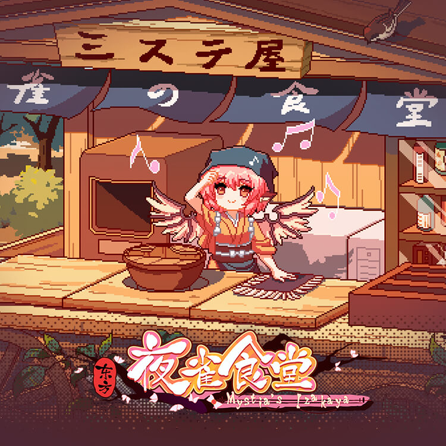
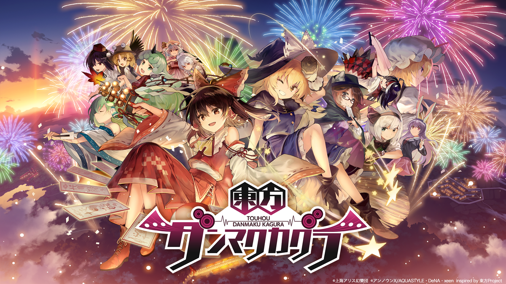

- 同人小说，Cosplay，周边制作，衍生文化
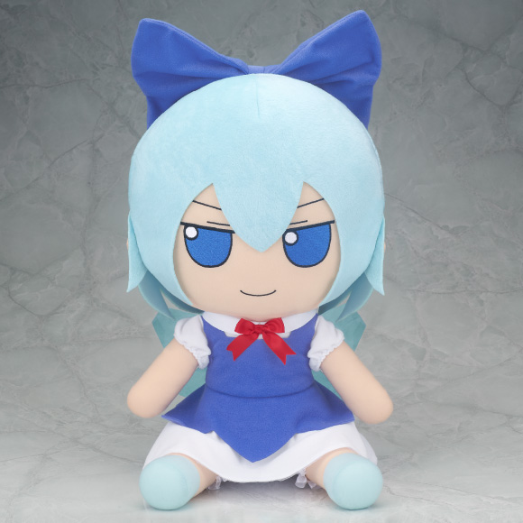

## 同人 & 二次创作

值得一提的是，在上面的介绍中，出现了 "同人" 和 "二次创作" 两个名词。虽然其看起来的很 trivial ，正如其名，但还是有必要在这里先澄清一下。

同人指的是... 

二次创作指的是...

## 小总结

简单总结一下，东方本身是日本同人游戏社团上海爱丽丝幻乐团所制作的一系列同人游戏、相关作品，以及基于前者由爱好者所创作的二次创作所共同构成的覆盖游戏，动漫，音乐，文学等诸多方面的领域。

东方 Project 系列经过二十余年的社群文化发展，如今，当我们在日常对话中使用“东方”这个名词时，含义已不仅限于指代由官方参与制作的游戏、出版物等内容。其主要由:

- 由官方参与创作的东方Project系列作品，即“原作”
- 没有官方参与的东方二次创作集合
- 社群构筑的东方文化

这三个方面构成。

粗略讲完了东方是什么，

# 游戏本身

# 音乐

(平板式交代分析)
东方能火的一个重要原因便是其独具特色的音乐...

# 官方设定

# 同人创作环境 (官方开放 + 日本同人文化 + 素材的特殊性)

# 幻想世界(价值观 related)

(幻想乡世界观 | )

[可选观点，东方 ~ 圆明园 ~ 幻想](https://zhidao.baidu.com/question/1836979186507519900.html)

## 东方火起来的时代因素(互联网 模因 滚雪球)

## 什么是东方 (重新定义) + 一些思考

# End
