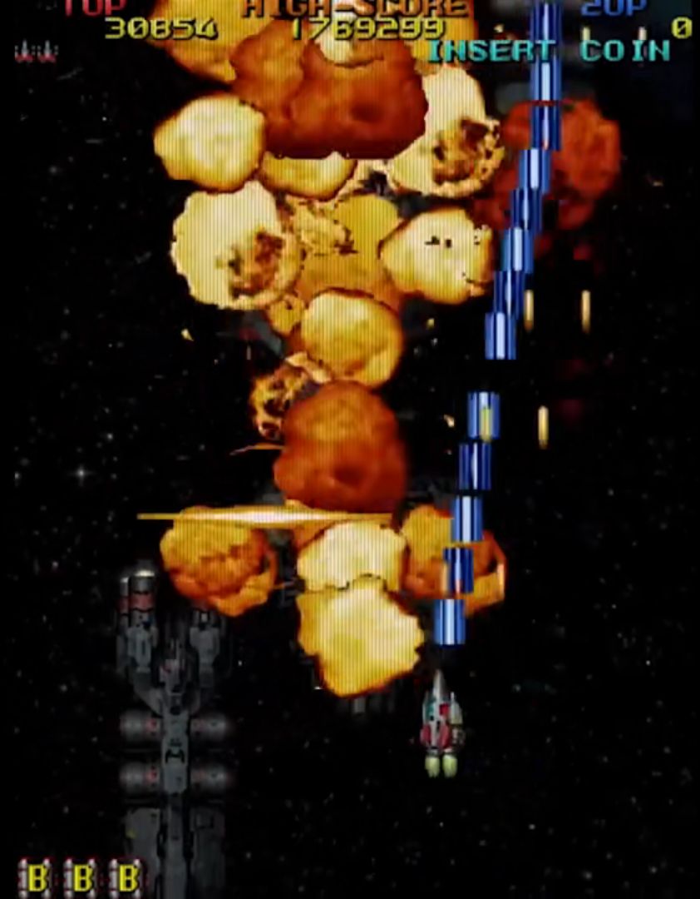
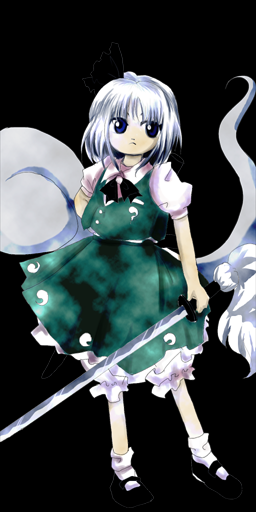

# Pre

横向 + 纵向结合

Define:

- [引用信息]
- (给自己看的内容)

画图澄清思路

# 引入

> 那是不知在何处、不知何时就存在的地方

> 在那里，人和精灵(其实是妖精)、鬼、妖怪等等不可思议的事物共存着

> 拥有众多力量，和不同目的的少女们，艰难摸索着来到了此处

> 温柔地包容着各种奇迹的那片大地……

> 它的名字是 ——

> “幻想乡” ......

(出自:[夜降り萃梦郷 ~ A Reverie of Dolls and Stellula](https://y.music.163.com/m/song?id=393858&uct=hWTVV82q2bU0EVvxZhm7IQ%3D%3D&dlt=0846&app_version=8.8.23&sc=wmv&tn=))

(可以截取部分音乐)

(点出"东方" 和 "幻想乡"的概念)

听了前面那段诗一般的文字里，我不知道大家会有什么样的感受。

就我个人而言，在我初次听到这段歌词的时候，它带我走向了這美麗的世界，"幻想乡"，在随后空灵的 bgm 柔和以及主唱人声当中，我彷彿進入了一個美好的夢境，不能自拔。而东方 project , 便是这一切幻想故事的起源。(ppt 转场)

东方 project 你可能不知道是什么，但你一定或多或少遇到以下这些经典的场景:

你是否在不经意间听到一些耳熟的 bgm ?
[央视中出现的东方音乐]

你是否在做题的时候突然遇见一些奇怪的题目背景?
[Luogu上的东方题目]

你是否见过这样集体狂欢的景象 ?
[b站镇站的东方视频]
(绯色月下，此生无悔，Bad apple!!)

没错，它们似乎都指向同一个相同的源头: 东方Project。

它有着华丽的弹幕，也有着大量精美的同人创作，更衍生了许多耳熟能详的旋律。其发展了 20 余年，粉丝遍布全球，二次创作作品数不胜数，诸多知名游戏公司的主创团队也创作过相关作品，甚至世界一流大学 ~~如明治大学~~ (比如[北京大学](https://thwiki.cc/ZUN/%E5%8C%97%E5%A4%A7%E6%BC%94%E8%AE%B2%E4%BC%9A)(挂个校徽) ) 也曾邀请作者出席动漫文化高端讲座，甚至请出了日本驻华大使馆代理大使。

东方究竟是何方神圣? 东方凭什么能火到如此 ? (抛问题)

下面，我将先粗略讲讲，东方到底是什么。(转场动画)

# 什么是东方

## 官方

东方 Project (日语：東方プロジェクト・とうほうぷろじぇくと，英语：Touhou Project，Project Shrine Maiden) ，简称东方，或称东方系列，是日本的同人社团 "上海爱丽丝幻乐团" (实际只有太田顺也一人，一般称作ZUN) 所制作的一系列以弹幕射击游戏为主的游戏 (Shooting Game)。第一部官方正作《东方红魔乡》于 2002 年发布，此后的25年间，ZUN 始终以一定频率持续发布新作品，至今为止已有 26 部官方游戏。

游戏主体是弹幕射击游戏，具体剧情大致涉及的是一些少女可能是妖怪甚至是神灵、发动了异变，而为了维持幻想乡的和平，你需要操作一个少女去解决异变，在一路上你会遇到一系列的敌人(当然基本都是少女)，你需要用发射的弹幕击败敌人，并最终解决这些异变。

既然作为 "幻乐团" ，自然是少不了音乐作品。迄今为止，ZUN以“ZUN's Music Collection”这个名字一共发布了11张专辑。每个专辑都包含再编曲的旧曲目，以及新的原创曲目。每个专辑都包含由ZUN所亲自编写的附赠“故事”。

除此之外，东方 Project 官方也发布有的非游戏载体的作品（基本为商业作品），以书籍、漫画、小说、杂志等为主。

## 二次创作以及其他社群

然而，当我们提及 "东方 Project" 这一个概念的时候，我们更多的时候并不仅仅想要指代的是 "上海爱丽丝幻乐团" 所制作的一系列同人游戏、相关作品。从前面放出的一些片段我们也不难看出，东方 Project 最出名恐怕并不是官方作品本身，而个更多的是由爱好者基于原作而进行的二次创作。

事实上，以东方二次创作为核心建立的社群，其规模和影响力已然不输官方作品，具备相当强大的影响力。其表现形式包括但不限于

- 同人音乐
  
  

(我手头的两张)
体量庞大、种类繁多的同人音乐作品正是东方 Project 非常具有特色的一点。由上图中，我们不难看出，东方同人音乐有巨大的体量，截止 2023 年 3 月，仅 wiki 上收录的专辑就有 19503 张，总曲数高达 158624 首。假如按照一首曲子平均时长 3:40 计算，大家数学都很好，可以算算连续不断地听，总共需要多久能听完。(403天)

- 同人绘画
  
  
  
  东方的同人绘画也是非常的出名。由于东方的角色众多，特征鲜明，加上无数画师挥毫泼墨，创作出了风格各异、独具特色的作品，以至于很多不了解东方的人也能了解东方。
- 同人视频
  
  
  
  
  
  东方在互联网上也有数量众多的二次创作的视频。既有基于已有音乐作品的音乐 pv ，有基于官方游戏而创作的场景还原 3D 动画，有还原游戏剧情而创作的类动画、番剧，也有各种借东方的人物进一步展开、表达作者自己的情感和价值观的手书。
- 二次创作游戏
  
  
  
- 同人小说，Cosplay，周边制作，衍生文化
  

简而言之，以东方二次创作为核心建立的社群，其有着数十倍于官方的规模和体量，涵盖了非常多的领域，构成了一个独特而绚丽多彩的亚文化。

而这一独特的同人景观，是东方 project 最显著的特色，是东方 project 吸引人气的重要途径，也奠定了东方 project 三大同人奇迹之一的地位。

## 同人 & 二次创作

值得一提的是，在上面的介绍中，出现了 "同人" 和 "二次创作" 两个名词。虽然其看起来的很 trivial ，正如其名，但还是有必要在这里先澄清一下。

同人作品对标的是商业作品，区别在于发布平台的性质（这个方面的区别其实越来越模糊了）和发行商的性质（个人/社团or企业）。从目的上来讲同人是不以盈利为目的（并不是不能盈利，虽然能做到的很少）从事的活动，是以兴趣爱好为主导的；而商业是以盈利为主要目的活动，是消费者取向主导的。

二次创作对标的是原创作品，不管你原作是商业还是同人，其界限在于是否采用现已存在的人物、背景、设定。这个应该不用我多说了吧。

常见的一个误区就是把同人等同于二次创作，其实同人创作也有很多搞原创同人的。比如东方游戏本身其实就是同人作品。讲到这你可能会觉得有点晕，以东方为例，我找了一张图，大致可以把 同人/二次创作 按照下下图区分。

事实上，在东方 project 的语境中，同人的概念和二次创作的概念常常被混淆，但是一般都指的是东方的二次创作的同人作品，在后文中也可能会有混用。在这里特别强调一下，只是希望大家能够了解一下同人和二次创作这两个在 ACG 文化中常见名词的真实含义。

## 小总结

简单总结一下，东方本身是日本同人游戏社团上海爱丽丝幻乐团所制作的一系列同人弹幕射击游戏、相关作品，以及基于前者由爱好者所创作的二次创作所共同构成的覆盖游戏，动漫，音乐，文学等诸多方面的领域。

东方 Project 系列经过二十余年的社群文化发展，如今，当我们在日常对话中使用“东方”这个名词时，含义已不仅限于指代由官方参与制作的游戏、出版物等内容。其主要由:

- 由官方参与创作的东方Project系列作品，即“原作”
- 没有官方参与的东方二次创作集合
- 社群构筑的东方文化

这三个方面构成。

# 过度段落

在简单的回答了东方究竟是什么之后，让我们步入第二个问题 —— 东方为什么会火 ? 东方究竟有什么样的魅力，能够在众多的游戏中脱颖而出，能够吸引着一代又一代的爱好者。

# 东方为什么会火

## 游戏主体

首先，让我来简要分析一下东方原作本体的特点。

### 弹幕美学 + 符卡

东方的游戏本身属于弹幕 STG (**S**hoo**t**ing **G**ame)类游戏，基本规则是躲避敌方射来的子弹，并且要用自己射击的子弹去攻击敌方。

在东方最早几个作品刚问世的年代，大概是 2005 年之前，市面上大部分的游戏还是相当的简陋。Zun 正是出于对于当时同人游戏质量的不满，做出了东方系列。

在游戏难度上，其的确算不上同类弹幕 STG 游戏中非常高难度的，甚至大部分作品只能排到中下游的水准。但是，真正让 东方游戏 本身从众多 STG 游戏中脱颖而出的，是其独特的美学理念。下面将会把 东方 和 老牌 弹幕 STG 游戏雷电进行比较。

首先，在弹幕整体形状上(这里指的是子弹构成的包络线)，其他大部分同类游戏的弹幕往往都是简单的几何图形，而弹幕本体则往往以圆点、子弹、炸弹等类似真实战场中的图像显示，颜色也往往比较单一化，如图所示。

而东方的弹幕在整体形状上则显得更加多样，其不仅仅局限于简单的圆形、直线，还有各种各种奇形怪状的函数曲线，甚至很多时候，其为了追求对称的美学，即使在玩家不会到达的地方，也会以一定规律填充弹幕。同时，弹幕本体的颜色和形状也是精心设计的，其完美地贴合了角色本身的特点，不同关卡也会有不同的表现。

(bonus : 换成 .gif)

说到这里，就不得不提到东方独特的符卡机制，其boss战斗进入一定阶段之后会触发，类似于 boss 的大招宣言，这时候弹幕会围绕这这个符卡进行攻击。在游戏中，每个角色都有自己的符卡，而使用符卡后，boss 则会释放出对应的弹幕，前面三幅图便对应的是三张符卡。而符卡本身紧密贴合角色本身特点，无论是名字上，还是表现形式上(例如第一幅图....)。

总而言之，比起同时代的弹幕射击 STG 类游戏，东方游戏在视觉上有着更强的冲击力，拥有精心设计的弹幕以及独创的符卡机制。

### 音乐性

东方能火的一个重要原因便是其独具特色的音乐。不同于大部分游戏的背景音乐往往只是作为背景板弱化节奏和旋律，东方游戏中的音乐往往有着突出的节奏感与旋律性，甚至在在一定程度上有点喧宾夺主。

在东方 STG 作品中，几乎所有的原曲都出现了小号。这种特殊电子音源的小号音色，也被称作 Zun 号，下面是一些实例:

[风神少女](https://music.163.com/song?id=29710952&userid=3215760601)

[寄世界于偶像](https://music.163.com/song?id=1384318412&userid=3215760601)

[墨染樱](https://music.163.com/song?id=22636709&userid=3215760601)

从上面这些的音乐，我们不难发现，小号都在音乐里面充当了一个非常突出的角色。这是因为小号的音色激烈、高亢，听起来振奋人心，而其高亢而振奋的音色与 stg 紧张刺激的频繁操作简直是相得益彰，就像一刻不停的冲锋号一样，让人仿佛现身于枪林弹雨的战场中，越来越兴奋。

不仅如此，听了上面这几段音乐，我们不难发现一个特征，它们都有一个比较突出且独特的旋律。简单来说，这是因为 Zun 在旋律上充分运用了日本的传统音乐的调式，使得曲子有明显的东方民族感。

例如下面这首曲子，就用到了富有浓郁传统东方(亚洲)气息的小调五声音阶。

[明日之盛,今日之俗](https://music.163.com/song?id=22636646&userid=3215760601)

此外，Zun 还在许多曲子还大胆的运用大量的不协和音，构造了一些独特的氛围。

例如下面这首曲子的预备副歌段 (Pre chorus) 其充满了各种不和谐的音程，听感较为扭曲而独特。而这种不安分感，紧张感也为后续副歌段落的情感释放做好了铺垫。

[哈德曼的妖怪少女](https://music.163.com/song?id=22636634&userid=3215760601)

这些使东方的音乐脱离了一般流行曲与普通电子乐，带来了独特的听感。

事实上，以上特点不是个例，大部分东方的原曲都有这样的特征。如果非要以欣赏全曲的角度去看东方原曲，事实上很多时候会发现原曲的结构非常单线性，往往只是一个旋律片段多次重复，每次仅在原来的基础上进行一些升降调以及其他小改动。

但是在音乐里面，重复不是什么缺点。事实上，重复的旋律可以作为一种 hook 。正是因为这一个片段非常 "洗脑" 、好听，而其在原曲中被恰到好处地重复，结合小号激烈而高亢的音色突出旋律本身，其能够潜移默化地增强了听众对于这段独特的旋律片段的印象，甚至让人很多时候只是期待着那段旋律出现。

除此之外，Zun 的作曲还有许多独具特色的地方，由于时间~~知识~~所限，这里将不过多展开。如果真的非常感兴趣的，可以去了解一下“游戏时代的新邦乐”这套书。

简而言之，这种独特的曲风，吸引了能不少的玩家，甚至是玩家之外的听众。甚至连 Undertale 的作者 Toby，这位著名的游戏作者兼作曲家 ，也深受东方原曲的影响。具体细节可以看其和 Zun 的会面(https://www.bilibili.com/read/cv1372245)，这里就不过多介绍了。

[reference](https://www.bilibili.com/video/BV1Dv4y1e7Qw/)

### 其他特点

东方游戏本体除了在视觉、听觉上有非常强大的冲击力，其在人物设计上也是有许多可圈可点的地方。

虽然不得不承认，东方原作的绘画，比起其他热门 ip 中精美的画面，确实差了一点味道。但是东方的人物，人物，其有一个突出的特点，就是每个人物都有自己突出的服饰特点(笑)。

比如下面这位金发的小女孩，从这张图里你第一眼能捕获什么样的信息。

- 黑色三角巫师帽
- 金色的头发，红色的蝴蝶结
- 黑白相间的服饰
- 坐在身体下面的扫帚

通过这些显著的特征，我们不难猜测，其身份是类似巫师一样的魔女，而且主要可以借助扫帚来飞行移动。

类似的人物设计方法在其他东方人物身上也有不少的体现。

东方的背景设定也是非常的耐人寻味。东方的故事虽然发生在"幻想乡"这个架空的世界之上，但是其却大量取材于现实，和现实世界有着大量的联系。幻想和现实，在这里碰撞，产生了不一样的火花。

因此，在幻想乡，你甚至可以看到: 女高中生巫女和两位神明发现了具有太阳一样的能力的八咫鸟，于是结合外界的核能源知识，借助八咫鸟的力量实现了核聚变，为神社带来绿色能源，甚至造出"高达"的故事。(此处应该有动画(笑))

在以上这段近乎是胡言乱语的描述中，我们能清晰的感受到东方原作天马行空的幻想，也能从"神社","核聚变","绿色能源"感受到现代社会的气息。

这也就是东方原作非常突出的一个特点: 幻想和现实的碰撞。那里的一切，是如此的熟悉如此的亲近，似乎都发生在你我所生活的世界，但遵循的，确实一套几乎完全不一样的规律。

引用之前描述的女高中生的一句话: 在幻想乡，可不能按照(外界世界的)常理出牌(笑)。

### 小总结

由于时间关系，细节太多，~~演讲者精力和实力有限~~没法讲的面面俱到，只能先详细分析以上这些。

概括来说，东方原作作为传统弹幕 STG 类游戏，其有着自己独特美学理念。

- 游戏内容上，其弹幕更加注重美感，形状多样、颜色丰富。独特的符卡机制进一步加强了弹幕和角色的表现力以及融合度。
- 音乐上，节奏感与旋律性兼备，背景音乐不再充当背景板，很多时候是敌机和子弹都是跟着音乐的节奏跳出来的。音乐成为了游戏不可分割的重要部分，牵动着玩家的情绪，推动了情节的发展。
- 在设定上，人物外貌特点鲜明，设定上各具特色，易于辨认。而故事背景所在的幻想乡，则是充满了幻想与现实的碰撞，既包含了生活中的方方面面，有着许多现实考据，又有着天马行空的想象。

在其刚诞生的那个年代，这样的一款游戏质量绝对属于上乘，而游戏背后的音乐，人物，以及背景设定和各种现实的映射，又可以进一步的吸引到更多不玩游戏的爱好者。

## 外部原因

### 同人创作

在前面，我们已经提到了东方是三大同人奇迹之一。其兴起必然和其数量众多，涵盖面极其广的同人作品有着千丝万缕的联系。那么究竟是为什么，东方能吸引到这么多的优秀的同人创作者呢?

- 日本同人文化

说到同人作品，就不得不提及日本的同人文化。

在 ACGN (Animation (动画)、Comic(漫画)、Game(游戏)、Novel(轻小说)) 文化圈中，同人这个词则引申为自创、不受商业影响的自我创作，或自主的创作。与有周密策划的商业化作品相比，同人有一种 “想创作什么，就创作什么” 的意味。

事实上，对于独具特色的日本 ACGN 文化，大多数人欣赏、交流、讨论、创作时，都很少通过商业化的专门形式进行，而是会以兴趣为驱动力，观赏免费资源、进行非盈利的创作、对商业化作品进行二次创作等。同人已经成为了宅文化极其重要的一部分：有研究机构媒体表示，2007年高达 16.5亿美元销售额的 ACGN 市场中,同人销售占48%(7.92亿美元)。

在日本，同人文化的历史也是非常悠久。自明治维新，就有志趣相投的人聚在一起以不正规的形式出版刊物的传统。这种非正式出版物被称作“同人志”。早先以文学爱好者的文学出版物为主，二战后逐渐开始有漫画同人志。日本的 ACGN 亚文化中的同人志文化一般可以追溯到 20 世纪 60 年代末 70 年代初，标志性时间点是 1975 年第一届 Comic Market 同人展的举办。

而到了 20 世纪末的时候，随着个人电脑在日本开始普及，Comic Market 同人展上，除了漫画和小说作品之外，个人和社团创作的动画、电脑游戏等也开始出现了。另外基于一些商业化作品的 “二次创作” 也发展起来。

在东方 project 诞生的年代，即 21 世纪初期，日本那边已经有了很成熟的同人市场运作体系。由下图不难看出，Comic Market 的参展作品数量已经达到了顶峰。而游客数量也达到了很庞大的规模。

因此，东方能有如此多的同人创作者，首先和日本当时昌盛的同人文化有着千丝万缕的关系。在互联网时代之前，昌盛的同人文化，为东方提供了最早的一批优秀的同人作者。

[reference](https://zhuanlan.zhihu.com/p/33115992)

[reference](https://zh.moegirl.org.cn/%E5%90%8C%E4%BA%BA)

- 官方开放

Zun 作为一个独立游戏制作人，在版权要求严苛的日本，有一个特别先进且具有创意的行为 —— 东方版权公约。Zun 公开表示，只要遵循版权公约，那么就默认为获得了授权，同人的创作者不必为获取版权向 Zun 联系。此外制作的同人物品只要是买断制，那么就可以在漫展上出售。举个例子，最常见的同人音乐 CD ，角色色纸画集，不含游戏内充钱的同人游戏，它们是可以在漫展上出售的。

e.g. 赛马娘(no r18)
e.g. Love live

而对比之下，那时的其他重量级日本 IP，如型月，任天堂等对版权的管控是很严格的，更不用说当时的欧美，大量的IP掌握在版权狂魔迪士尼手上，爱好者们纵使想要创造同人，也得警惕任地狱和迪士尼的律师函。而东方没有这个限制。因此在那个时代的环境下，东方完成了最初的人气积累。

- 素材的特殊性:

当然说了这么多关于日本独特的同人文化，以及官方早期对于同人创作的开放态度，这都代表不了什么。"打铁还需自身硬" ，日本的客观环境、官方的态度就是像是一块优质的铁矿石，而最终打造出 "东方" 这一块 "好铁"，必然需要东方原作本身够 "硬" 。

1. 多元文化碰撞
2. 有考据可循，许多基于历史和传说
3. 作品数量庞大，角色众多，有广泛的题材；音乐非常有特色，有着令人深刻的旋律，为二次创作者提供了丰富的素材；人物设定非常独特，每个人都有自己的故事；最重要的是，作品有许多的留白，耐人寻味，仍有挖掘空间。

  结果是有丰富多元的同人作品: 音乐

### 互联网

- 网络模因
- 滚雪球效应

除此之外，非常重要的一点是，东方迅速在互联网完成了初始人气积累之后，其很容易借助滚雪球效应而迅速增长人气。

这是因为

对于后续的入坑的同人创作者来说，入坑东方象征着:

1. 创作同人有明确的界限，一个清晰的界限不会有法律风险。
2. 东方有现成的巨大人气，一个初学者创作出优秀的东方作品后得到大量同好的支持。
3. 有额外的经济收益（重要），用爱发电，爱烧完了就结束了，以后就是不会再挖坑的边缘观望状态，当同人制作得到回报之后，自然有动力继续创作作品

而对于其他的入坑者，早期东方在互联网上丰富的资源则给予了入坑东方极大的便利。随处可见的东方 bbs 论坛，视频网站上各种热榜第一的东方视频，大量

[reference](https://www.zhihu.com/question/557686707/answer/2713542076)

### 幻想乡世界观 ( 10 %)

当然，如果东方仅仅只是一个拥有很多同人创作作品的游戏，那么其远不足以成为一个经久不衰的热门 IP 。事实上，东方远不止是一款游戏、一个故事那么简单，其本身凭借庞大的世界观、奇幻的异世界背景和充分的留白，构成了一个虚构、独特的世界体系。

在其大火的背后，其实反映了人们对于其背后虚构的幻想世界的一种认同。

* 幻想性 + 现实性的碰撞
* 脱离世界

[reference](https://www.bilibili.com/video/BV1bG4y1n75f/)

[reference](https://www.bilibili.com/video/BV1Hf4y177wF)

[reference](https://www.zhihu.com/question/492084056/answer/2198081401)

[reference](https://www.zhihu.com/question/571591252/answer/2795885337)

# 什么是东方 + 为什么能火 (重新定义) + 一些思考 (5%)

现在，在了解了东方为什么能火的一些原因后，我想是时候重新认识一下，东方到底是什么了。

所以为什么能火? 简单来说，无非就是:

但他们都只是表面的现象。而东方 project 真正触动我们的地方，在于:

对于我们今后树立 IP 的启示 (?)

对于我们的启示 (?)

# End (夹带私货，我要输出情绪!!!)
