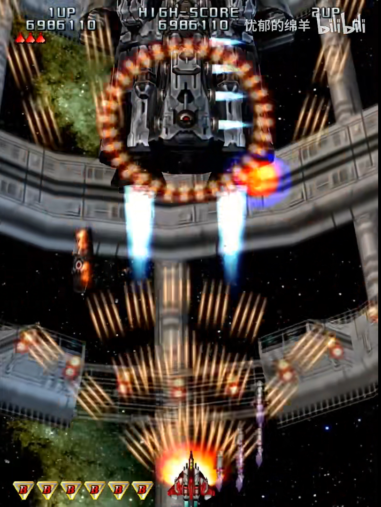
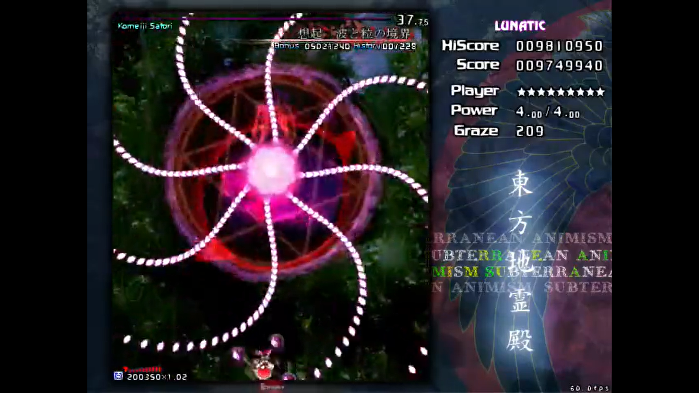

# 引入

> 那是不知在何处、不知何时就存在的地方

> 在那里，人和精灵(其实是妖精)、鬼、妖怪等等不可思议的事物共存着

> 拥有众多力量，和不同目的的少女们，艰难摸索着来到了此处

> 温柔地包容着各种奇迹的那片大地……

> 它的名字是 ——

> "幻想乡" ......

(出自:[夜降り萃梦郷 ~ A Reverie of Dolls and Stellula](https://y.music.163.com/m/song?id=393858&uct=hWTVV82q2bU0EVvxZhm7IQ%3D%3D&dlt=0846&app_version=8.8.23&sc=wmv&tn=))

(可以截取部分音乐)

(点出"东方" 和 "幻想乡"的概念)

听了前面那段诗一般的文字里，我不知道大家会有什么样的感受。

就我个人而言，在我初次听到这段歌词的时候，它带我走向了這美麗的世界，"幻想乡"，在随后空灵的 bgm 柔和以及主唱人声当中，我彷彿進入了一個美好的夢境，不能自拔。而东方 project , 便是这一切幻想故事的起源。(ppt 转场)

东方 project 你可能不知道是什么，但你一定或多或少遇到以下这些经典的场景:

你是否在不经意间听到一些耳熟的 bgm ?
[央视中出现的东方音乐]

你是否在做题的时候突然遇见一些奇怪的题目背景?
[Luogu上的东方题目]

你是否见过这样集体狂欢的景象 ?
[b站镇站的东方视频]
(绯色月下，此生无悔，Bad apple!!)

没错，它们似乎都指向同一个相同的源头: 东方Project。

它有着华丽的弹幕，也有着大量精美的同人创作，更衍生了许多耳熟能详的旋律。其发展了 20 余年，粉丝遍布全球，二次创作作品数不胜数，诸多知名游戏公司的主创团队也创作过相关作品，甚至世界一流大学 ~~如明治大学~~ (比如[北京大学](https://thwiki.cc/Zun/%E5%8C%97%E5%A4%A7%E6%BC%94%E8%AE%B2%E4%BC%9A)(挂个校徽) ) 也曾邀请作者出席动漫文化高端讲座，甚至请出了日本驻华大使馆代理大使。

东方究竟是何方神圣? 东方凭什么能火到如此 ? (抛问题)

下面，我将先粗略讲讲，东方到底是什么。(转场动画)

# 什么是东方

## 官方

东方 Project (日语：東方プロジェクト・とうほうぷろじぇくと，英语：Touhou Project，Project Shrine Maiden) ，简称东方，是日本的同人社团 "上海爱丽丝幻乐团" (实际只有太田顺也一人，一般称作Zun) 所制作的一系列以弹幕射击游戏为主的游戏 (Shooting Game)。第一部官方正作《东方红魔乡》于 2002 年发布，此后的25年间，Zun 始终以一定频率持续发布新作品，至今为止已有 26 部官方游戏。

游戏主体是弹幕射击游戏，具体剧情大致涉及的是一些少女，或是妖怪、或是神灵，发动了异变。而为了维持幻想乡的秩序，你需要操作一个少女去解决异变，在一路上你会遇到一系列的敌人，当然也都是少女，你需要用发射的弹幕击败敌人，并最终解决这些异变。这里就不过多展开了，感兴趣的可以课后找我了解(笑)。

既然作为 "幻乐团" ，自然是少不了音乐作品。迄今为止，Zun以"ZUN's Music Collection"这个名字一共发布了11张专辑。每个专辑都包含再编曲的旧曲目，以及新的原创曲目。每个专辑都包含由Zun所亲自编写的附赠"故事"。

除此之外，东方 Project 官方也发布有的非游戏载体的作品（基本为商业作品），以书籍、漫画、小说、杂志等为主。

## 二次创作以及其他社群

然而，当我们提及 "东方 Project" 这一个概念的时候，我们更多的时候并不仅仅想要指代的是 "上海爱丽丝幻乐团" 所制作的一系列同人游戏、相关作品。从前面放出的一些片段我们也不难看出，东方 Project 最出名恐怕并不是官方作品本身，而个更多的是由爱好者基于原作而进行的二次创作。

事实上，以东方二次创作为核心建立的社群，其规模和影响力已然不输官方作品，具备相当强大的影响力。其表现形式包括但不限于

- 同人音乐
  
  
  (我手头的三张专辑)

体量庞大、种类繁多的同人音乐作品正是东方 Project (我个人认为)最具有特色的一点。由上图中，我们不难看出，东方同人音乐有巨大的体量，截止 2023 年 3 月，仅 wiki 上收录的东方同人专辑就有 19503 张，总曲数高达 158624 首。假如按照一首曲子平均时长 3:40(220s) 计算，大家数学都很好，可以算算连续不断地听，总共需要多久能听完。(403天)

- 同人绘画

  
  
  

  东方的同人绘画也是非常的出名。由于东方的角色众多，特征鲜明，加上无数画师挥毫泼墨，创作出了风格各异、独具特色的作品，以至于很多不了解东方的人也能因此了解东方，甚至爱上其中的角色。
- 同人视频

  
  
  
  
  

  东方在互联网上也有数量众多的二次创作的视频。既有基于已有音乐作品的音乐 pv ，有基于官方游戏而创作的场景还原 3D 动画，有还原游戏剧情而创作的动画、番剧，也有各种借东方的人物进一步展开、表达作者自己的情感和价值观的手书。各种各样的形式都能被看到。
- 二次创作游戏

  
  
  
- 同人漫画、小说，Cosplay，周边制作，衍生文化

  

简而言之，以东方二次创作为核心建立的社群，其有着数十倍于官方的规模和体量，涵盖了非常多的领域，构成了一个独特而绚丽多彩的亚文化。

而这一独特的同人景观，是东方 project 最显著的特色，是东方 project 吸引人气的重要途径，也奠定了东方 project 三大同人奇迹之一的地位。

## 同人 & 二次创作

值得一提的是，在上面的介绍中，出现了 "同人" 和 "二次创作" 两个名词。虽然其看起来的很 trivial ，正如其名，但还是有必要在这里先澄清一下。

同人作品对标的是商业作品，区别在于发布平台的性质（这个方面的区别其实越来越模糊了）和发行商的性质（个人/社团or企业）。从目的上来讲同人是不以盈利为目的（并不是不能盈利）从事的活动，是以兴趣爱好为主导的；而商业是以盈利为主要目的活动，是消费者取向主导的。

二次创作对标的是原创作品，不管你原作是商业还是同人，其界限在于是否采用现已存在的人物、背景、设定。这个应该不用我多说了吧。

常见的一个误区就是把同人等同于二次创作，其实同人创作也有很多搞原创同人的。比如东方游戏本身其实就是同人作品。讲到这你可能会觉得有点晕，以东方为例，我找了一张图，大致可以把 同人/二次创作 按照下下图区分。

事实上，在东方 project 的语境中，同人的概念和二次创作的概念常常被混淆，但是一般都指的是东方的同人二次创作作品，在后文中也可能会有混用。在这里特别强调一下，只是希望大家能够了解一下同人和二次创作这两个在流行亚文化中常见名词的原始含义。

## 小总结

简单总结一下，东方本身是日本同人游戏社团上海爱丽丝幻乐团所制作的一系列同人弹幕射击游戏、相关作品，以及基于前者由爱好者所创作的二次创作所共同构成的覆盖游戏，动漫，音乐，文学等诸多方面的领域。

东方 Project 系列经过二十余年的社群文化发展，如今，当我们在日常对话中使用"东方"这个名词时，含义已不仅限于指代由官方参与制作的游戏、出版物等内容。其主要由:

- 由官方参与创作的东方Project系列作品，即"原作"
- 没有官方参与的东方二次创作集合
- 社群构筑的东方文化

这三个方面构成。

# 过度段落

在简单的回答了东方究竟是什么之后，让我们步入第二个问题 —— 东方为什么会火 ? 东方究竟有什么样的魅力，能够在众多的游戏中脱颖而出，能够吸引着一代又一代的爱好者。

# 东方为什么会火

## 游戏主体

首先，让我来简要分析一下东方原作本体的特点。

### 弹幕美学 + 符卡机制

东方的游戏本身属于弹幕 STG (**S**hoo**t**ing **G**ame)类游戏，基本规则是躲避敌方射来的子弹，并且要用自己射击的子弹去攻击敌方。

在东方最早几个作品刚问世的年代，大概是 2005 年之前，市面上大部分的游戏还是相当的简陋。Zun 正是出于对于当时同人游戏质量的不满，做出了东方系列。

在游戏难度上，其的确算不上同类弹幕 STG 游戏中非常高难度的，甚至大部分作品只能排到中下游的水准。但是，真正让 东方游戏 本身从众多 STG 游戏中脱颖而出的，是其独特的美学理念。下面将会把 东方 和 老牌 弹幕 STG 游戏雷电进行比较。

首先，在弹幕整体形状上(这里指的是子弹构成的包络线)，其他大部分同类游戏的弹幕往往都是简单的几何图形，而弹幕本体则往往以圆点、子弹、炸弹等类似真实战场中的图像显示，颜色也往往比较单一化，如图所示。

而东方的弹幕在整体形状上则显得更加多样，其不仅仅局限于简单的圆形、直线，还有各种各种奇形怪状的函数曲线，甚至很多时候，其为了追求对称的美学，即使在玩家不会到达的地方，也会以相同规律填充弹幕。同时，弹幕本体的颜色和形状也是精心设计的，其完美地贴合了角色本身的特点，不同关卡也会有不同的表现。

(bonus : 换成 .gif)

说到这里，就不得不提到东方独特的符卡机制，其boss战斗进入一定阶段之后会触发，类似于 boss 的大招宣言，这时候弹幕会围绕这这个符卡进行攻击。在游戏中，每个角色都有自己的符卡，而使用符卡后，boss 则会释放出对应的弹幕，前面三幅图便对应的是三张符卡。而符卡本身紧密贴合角色本身特点，无论是名字上，还是表现形式上(例如第一幅图....)。

总而言之，比起同时代的弹幕射击 STG 类游戏，东方游戏在视觉上有着更强的冲击力，拥有精心设计的弹幕以及独创的符卡机制，有着自己独创的游戏美学。

### 音乐性

东方能火的一个重要原因便是其独具特色的音乐。不同于大部分游戏的背景音乐往往只是作为背景板弱化节奏和旋律，东方游戏中的音乐往往有着突出的节奏感与旋律性，甚至在在一定程度上有点喧宾夺主。

在东方 STG 作品中，几乎所有的原曲都出现了小号。这种特殊电子音源的小号音色，也被称作 Zun 号，下面是一些实例:

[风神少女](https://music.163.com/song?id=29710952&userid=3215760601)

[寄世界于偶像](https://music.163.com/song?id=1384318412&userid=3215760601)

[墨染樱](https://music.163.com/song?id=22636709&userid=3215760601)

从上面这些的音乐，我们不难发现，小号都在音乐里面充当了一个非常突出的角色。这是因为小号的音色激烈、高亢，听起来振奋人心，而其高亢而振奋的音色与 stg 紧张刺激的频繁操作简直是相得益彰，~~就像一刻不停的冲锋号一样，让人仿佛现身于枪林弹雨的战场中，越来越兴奋~~。

不仅如此，听了上面这几段音乐，我们不难发现一个特征，它们都有一个比较突出且独特的旋律。简单来说，这是因为 Zun 在旋律上充分运用了日本的传统音乐的调式，使得曲子有明显的东方民族感。

例如下面这首曲子，就用到了富有浓郁传统东方(亚洲)气息的小调五声音阶。

[明日之盛,今日之俗](https://music.163.com/song?id=22636646&userid=3215760601)

此外，Zun 还在许多曲子还大胆的运用大量的不协和音，构造了一些独特的氛围。

例如下面这首曲子的预备副歌段 (Pre chorus) 其充满了各种不和谐的音程，听感较为扭曲而独特。而这种不安分感，紧张感也为后续副歌段落的情感释放做好了铺垫。

[哈德曼的妖怪少女](https://music.163.com/song?id=22636634&userid=3215760601)

这些使东方的音乐脱离了一般流行曲与普通电子乐，带来了独特的听感。

事实上，以上特点不是个例，大部分东方的原曲都有这样的特征。如果非要以欣赏全曲的角度去看东方原曲，事实上很多时候会发现原曲的结构非常单线性，往往只是一个旋律片段多次重复，每次仅在原来的基础上进行小改动。

但是在音乐里面，重复不是什么缺点。事实上，重复的旋律可以作为一种 hook 。正是因为这一个片段非常 "洗脑" 、好听，而其在原曲中被恰到好处地重复，其能够潜移默化地增强了听众对于这段独特的旋律片段的印象，甚至让人很多时候只是期待着那段旋律出现。

除此之外，Zun 的作曲还有许多独具特色的地方，由于时间~~知识~~所限，这里将不过多展开。如果真的非常感兴趣的，可以去了解一下 "游戏时代的新邦乐" 这套书。

简而言之，这种独特的曲风、有趣的旋律，吸引了能不少的玩家，甚至是玩家之外的听众。甚至连 Undertale 的作者 Toby，这位著名的游戏作者兼作曲家 ，也深受东方原曲的影响。具体细节可以看其和 Zun 的会面(https://www.bilibili.com/read/cv1372245)，这里就不过多介绍了。

[reference](https://www.bilibili.com/video/BV1Dv4y1e7Qw/)

### 服饰

东方游戏本体除了在视觉、听觉上有非常强大的冲击力，其在人物设计上也是有许多可圈可点的地方。

虽然不得不承认，东方原作的绘画，比起其他热门 ip 中精美的画面，确实差了一点味道。但是东方的人物，人物，其有一个突出的特点，就是每个人物都有自己突出的特点(笑)。

在细节上，比如头发、衣饰、配件的设计与处理，Zun 画得极其认真详细。每个人物都有其独特的、一目了然的标志物:

比如谈到博丽灵梦，就是红白蝴蝶结、巫女服、御币。

谈到魔理沙，就是金发、大魔女帽、黑白相间的服饰。

类似的人物设计方法在其他东方人物身上也有不少的体现。

这为二次创作提供了详尽的指导。Zun绘在角色设计这一功能上做得可谓比较完美。

### 背景设定

东方的背景设定也是非常的耐人寻味。东方的故事虽然发生在"幻想乡"这个架空的世界之上，但是其却大量取材于现实，和现实世界有着大量的联系。幻想和现实，在这里碰撞，产生了不一样的火花。

因此，在幻想乡，你甚至可以看到: 女高中生作为巫女和两位神明发现了具有太阳一样的能力的八咫鸟，于是结合外界的核能源知识，借助八咫鸟的力量实现了核聚变，为神社带来绿色能源，甚至造出"高达"的故事。(此处应该有动画(笑))

在以上这段近乎是胡言乱语的描述中，我们能清晰的感受到东方原作天马行空的幻想，也能从"神社","核聚变","绿色能源"感受到现代社会的气息。

这也就是东方原作非常突出的一个特点: 幻想和现实的碰撞。那里的一切，是如此的熟悉如此的亲近，似乎都发生在你我所生活的世界，但遵循的，确实一套几乎完全不一样的规律。

引用之前描述的女高中生的一句话: 在幻想乡，可不能按照(外界世界的)常理出牌(笑)。

#### 选材

东方原作素材的涉及面非常广泛。其不仅兼并幻想与现实，除了传统日本的元素例如神社、巫女、竹取物语，还有其他地方的民俗传说。例如原作中的角色霍青娥便出自《聊斋志异》，而角色纯狐则与中国古代后羿与嫦娥的传说有所关联，甚至其服装都是以清装与汉服结合设定的服装。

当然，东方原作也结合了一部分西方的元素，例如洋装吸血鬼。

除了传统元素，东方原作的素材还有许多大量现代科学，涉及不同学科领域，就比如说前面提到的 "核聚变" "电" 就涉及了现代物理学。

又比如说角色古明地恋，古明地恋拥有操纵无意识的程度的能力。对于她本身来说，这使得她可以在无意识的状态下行动。

不知道大家在听前面这首曲子 "哈德曼的妖怪少女" 的时候有没有想到什么。事实上，哈德曼可以指心理学界两个著名的人物。一个是卡尔·罗伯特·爱德华·冯·哈德曼，他最著名的作品为《无意识的哲学》。还有一个是海因兹·哈德曼，他继承了弗洛伊德和安娜的自我心理学思想，创建了自我心理学理论体系。

而古明地恋其 "无意识" 的设定，以及其众多与自我心理学相关的符卡 (如 -表象「弹幕偏执症」 -本能「本我的解放」-抑制「Super Ego」)，处处与之相契合。

除了现代科学，东方原作还揉杂了不少的宗教元素，《东方星莲船》和《东方神灵庙》这两部作品整体背景分别是佛教与道教，而神社这个概念本身就是日本原始宗教(神道教)的祭祀场所......

说到这里，大家可能有点晕了。没事，我也挺晕的。但从前面大段的描述中，大家应该不难感受到，东方的选材面真的是无比的宽广。传统与现代、东方与西方、不同的宗教，在幻想乡这幻想与现实交融的土地上和谐共生，正如引言中所云 "幻想乡，温柔地包容着各种奇迹"。

### 小总结

由于时间关系，细节太多，~~演讲者精力和实力有限~~没法讲的面面俱到，只能先详细分析以上这些。

概括来说，东方原作作为传统弹幕 STG 类游戏，其有着自己独特美学理念。

- 游戏内容上，其弹幕更加注重美感，形状多样、颜色丰富。独特的符卡机制进一步加强了弹幕和角色的表现力以及融合度。
- 音乐上，节奏感与旋律性兼备，背景音乐不再充当背景板，很多时候是敌机和子弹都是跟着音乐的节奏跳出来的。音乐成为了游戏不可分割的重要部分，牵动着玩家的情绪，推动了情节的发展。
- 在设定上，人物外貌特点鲜明，设定上各具特色，易于辨认。而故事背景所在的幻想乡，则是充满了幻想与现实的碰撞，既包含了生活中的方方面面，有着许多现实考据，又有着天马行空的想象。

在其刚诞生的那个年代，这样的充满独特的游戏美学的一款游戏，质量绝对属于上乘。而游戏背后的音乐，人物，以及背景设定和各种现实的映射，又可以进一步的吸引到更多不玩游戏的爱好者。

## 外部原因

### 同人创作

在前面，我们已经提到了东方的兴起，和其数量众多，涵盖面极其广的同人作品有着千丝万缕的联系。事实上，前面也已经讲到，东方同人的体量以及涵盖非的领域，已经远远超过了东方原作，相当大一部分东方的爱好者，也是在解除东方同人之后才入坑东方。

那么究竟是为什么，东方能吸引到如此多的优秀的同人创作者呢? 而又是为什么东方的同人是如此的独特?

#### 官方开放

Zun 作为一个独立游戏制作人，在版权要求严苛的日本，有一个特别先进且具有创意的行为 —— 东方版权公约。Zun 公开表示，只要遵循版权公约，那么就默认为获得了授权，同人的创作者不必为获取版权向 Zun 联系。此外制作的同人物品只要是买断制，那么就可以在漫展上出售。举个例子，最常见的同人音乐 CD ，角色色纸画集，不含游戏内充钱的同人游戏，它们是可以在漫展上出售的。

插句题外话，由于中国国内的版权意识相对比较薄弱，各种和谐版、学习版的软件、盗版周边也经常在用，因此大家对这样的条约可能没有什么概念。事实上，按照知识产权的相关法律，这类行为都是违反法律的，只要产权方想要告你，几乎是 100% 胜诉。只不过由于盗版的体量小，对于正版的影响不大，而起诉成本可能甚至高于胜诉带来的收益，因此许多产权方对此是睁一只眼闭一只眼的态度。

话说回来，在那个时代，比起东方，其他重量级日本 IP，如型月，任天堂等对版权的管控是很严格的，更不用说当时的欧美，大量的IP掌握在版权狂魔迪士尼手上，爱好者们纵使想要创造同人，也得警惕任地狱和迪士尼的律师函。

而东方没有这些限制。对于非商业化的同人二次创作，Zun 的条约可以说几乎没有施加任何的限制。因此，在那个时代的环境下，开放的版权政策，为东方吸引了不少的同人创作者。

#### 素材的特殊性

当然说了这么多关于日本独特的同人文化，以及官方早期对于同人创作的开放态度，这都代表不了什么。"打铁还需自身硬" ，日本的客观环境、官方的态度就是像是一块优质的铁矿石，而最终打造出 "东方" 这一块 "好铁"，必然需要东方原作本身够 "硬" 。

除了前面分析的东方原作的那些可以吸引创作者优点，或者说特点，东方原作的题材也特别适合二次创作加工。

首先，东方原作本身的素材面非常广。在幻想乡，幻想与现实交织，科学与宗教并存，东西方文化在此交融，各种不可思议的奇迹在这里共生。虽然这对于圈外人来讲，乍一看可能非常令人困扰，费解，甚至头晕。但是对于同人创作者，丰富的题材、不同文化的交融，简直就是取之不尽用之不竭的素材宝库。

在这里，就要拿同样被称为 "ACG 三大邪教" 之一(当然指的是非常风靡) 的 Lovelive! 作为对比了。

Lovelive! 作品本身虽然质量不俗，甚至可以说绘画音乐的精致程度，远超过东方原作。但是，其作品主题是"校园偶像企划"，主要是大家一起实现成为校园偶像的梦想的故事。在同人创作者进行二次创作的时候，其很难跳脱出这个框架，从而导致二次创作的受众面相对较窄。

相比之下，东方，作为一个深厚的素材池，再加上浓浓的 "幻想" 属性，以及几乎没有任何约束的 "二次创作条约" ，其同人二次创作的题材可谓是毫无限制。无论是发生于原作的幻想乡，还是我们身边的现代社会，没有什么是东方不能包容的。

同样重要的还有一点，那就是东方原作的设定，充满了留白，甚至瑕疵，无论是作品本身，还是其独具特色的音乐。

前面讲到了东方原作取材面非常广，但是原作并没有为每个细节都做出合理的阐释。即使官方后来推出了一些设定集，一定程度上完善了人物形象和细节，其反而挖了更多的坑，为考据和同人创作留下了更多的细节。事实上，Zun 也在访谈中提到，这是其刻意为之的结果，

整体而言，东方原作只是提供了一个大体的世界观，以及分布非常零散一些设定碎片。而由于前面讲到东方原作的特色，这些碎片本身相当的有标识度，一个人物，一首或若干首动听的曲子，几张标志性的符卡，加上细致的服饰等特征，结合上少许人物背景加上更多的留白，构成了一个极其富有标识度的设定碎片。

这些碎片虽然不够好看，但是很好用啊(笑)。一个现成的世界观，一些极具特色的地点和人物，大量的留白，这些都是很好的创作素材。留白，甚至是瑕疵，给其他作者以创作空间；较高的特色标识，又能保证不会偏离原有形象太多。

这里有一个很直观的例子:

- 东方原作，是对于 历史人物和神话传说 的二次创作，但当我们提及东方原作的人物的时候，大部分爱好者肯定会将其归为东方原创的。
- 而东方同人二次创作作品，是对于东方原作的二次创作，而我们提及东方同人作品中的角色的时候，我们更多会把里面人物归为东方的，而不会把其当作同人作品里面的，这是因为原作的人物有太多富有标识度的特点。

而这一点也注定了东方的同人二次创作创作可以为东方这一个整体带来人气，而不是仅仅为二次创作的作品本身引流。

事实上，东方就像一个‘艺术衍生品’制作者的温床，完全原创门槛高，制作者很难统一思想等很现实的问题，都让东方这个大型素材库给解决了。(插句题外话，其实之前 chayso 同学讲到的虚拟歌姬厂家 Vocaloid 也是类似的，解决了部分财力、能力不足的制作者遇到的现实问题)。

#### 音乐的特殊性

在东方独具特色的音乐方面，其一样如此。前面分析到，东方原作的音乐其实往往是结构非常单线性，只是一个非常洗脑的旋律片段多次重复，很多曲子由于是游戏用，因此结尾是以循环播放来代替，其完成度不是很高，而且独具 Zun 式特色的尖锐 "小号" 也不是所有人都欣赏的来。

一般创作一首曲子，需要经历 作曲，编曲，后期处理(混音母带) 等过程。单从编曲和后期处理的角度来看，Zun 的曲子完全算不上 "非常好"，只能称的上 "还行"，而且还带有强烈的 Zun 式风格，这种风格不是所有人都接受的来的。

但是，原曲中那一个个的独特的旋律片段，可以为同人创作中提供绝佳的素材。其可以帮助同人创作者跳过 作曲 这一阶段，同人创作者只需对曲子进行再改编和后期处理即可。要知道一般做出一段好听的旋律是极其困难的，而东方，则为那些苦于作曲的音乐人，提供了绝佳的旋律素材。

事实上，很多东方原曲，在经过了同人二次创作再改变后，反而会比原曲在整体上更加优秀。例如前面提及的 Bad Apple!! 等等，其知名度和精致程度是远超过原曲的。而二次创作的改编后的曲子，可以有不同于原作的音乐风格，这也扩大了东方曲的受众面，使得更多的听众能通过自己熟悉的曲风接触到东方的音乐，进而入坑。从大众化的的流行音乐，到激烈的摇滚乐，再到年轻的电子音乐，富有地方特色民族音乐，乃至大气磅礴的交响乐，只有你想不到，没有东方同人音乐做不到(笑)。

[reference](https://www.zhihu.com/question/61532772/answer/380778047)

#### 日本同人文化

讲了这么多同人作品，就不得不顺带提及日本的同人文化。

在 ACG (Animation (动画)、Comic(漫画)、Game(游戏)，现在也又 ACGN，Novel(轻小说)) 文化圈中，大多数人欣赏、交流、讨论、创作时，都很少通过商业化的专门形式进行，而是会以兴趣为驱动力，观赏免费资源、进行非盈利的创作、对商业化作品进行二次创作等。数据表明，2007 年高达 16.5 亿美元销售额的 ACG 市场中，同人销售占 48%。

在日本，同人文化的历史也是非常悠久。自明治维新，就有志趣相投的人聚在一起以不正规的形式出版刊物的传统。这种非正式出版物被称作"同人志"。早先以文学爱好者的文学出版物为主，二战后逐渐开始有漫画同人志。日本的 ACGN 亚文化中的同人志文化一般可以追溯到 20 世纪 60 年代末 70 年代初，标志性时间点是 1975 年第一届 Comic Market 同人展的举办。

而到了 20 世纪末的时候，随着个人电脑在日本开始普及，Comic Market 同人展上，除了漫画和小说作品之外，个人和社团创作的动画、电脑游戏等也开始出现了。

在东方 project 诞生的年代，即 21 世纪初期，日本那边已经有了很成熟的同人市场运作体系。由下图不难看出，Comic Market 的参展作品数量已经达到了顶峰(场地大小限制)。而游客数量也达到了很庞大的规模。

因此，东方能有如此多的同人创作者，和日本当时昌盛的同人文化有着千丝万缕的关系。昌盛的同人文化，在互联网时代来临之前，为东方提供了最早的一批优秀的同人作者。

[reference](https://zhuanlan.zhihu.com/p/33115992)

[reference](https://zh.moegirl.org.cn/%E5%90%8C%E4%BA%BA)

#### 互联网

随着时代的发展，互联网技术也在不断发展。

由于时间限制，加上个人能力的限制，只能从表面分析互联网在东方 project 发展的过程中，带来的部分影响。若大家对这方面刚兴趣，可以了解一下 smarthehe 同学的学术写作论文: "中国互联网亚文化探究"，其中涉及的很多的现象以及概念，例如模因与梗文化、复读机等等，其实也是影响东方、乃至其他现代 ip 发展过程的共性的东西。

- 互联网机遇

  在东方已经在同人圈内小有名气的时候，互联网革命正在悄悄地到来。在 2006 年，一家叫做 niconico动画 (后简称为 n 站) 的线上影片分享网站在日本上市，其类似 Youtube 等视频网站，但额外提供观赏者可在影片上留言的功能，而留言会以弹幕的形式出现在影片上。其在很短的时间内成为了日本 ACG 界最火热的视频网站，各类爱好者都在上面上传相关的视频。由于视频网站相比传统媒介的高效性，各种同人二次创作作品得以快速传播，东方作为当时同人体量庞大的一个 ip ，自然会极大地受益其中。而 Bad Apple!! 和 绯色月下 以及 琪露诺的算术教室 等一系列东方同人作品在 niconico 上，或是因为其高超的质量，或是因为运气，其收获了极大的关注量，在互联网上病毒一样地传播，进一步吸引力新的一批用户。~~在国内，早期仿照 niconico 运作模式的 bilibili (后简称 b 站) ，其在最开始的时候大量从 niconico 上搬运一些热门视频，而当时东方正好在 niconico 上如日中天，因而早期 b 站也是充满了东方的视频，而这也在国内吸引了很大的一批早期的东方爱好者。~~

  伴随互联网革命诞生的除了有视频网站，还有大大小小的网络论坛。由于东方当时正处于其人气快速上升期，加上东方原作中大量引用历史的设定，其吸引了许多的 "考据党" 去深入研究讨论，也提供给普通爱好者一个交流分享的平台。这一方面为已经入坑的爱好者提供了一个共生的平台，让其拥有了更强的归属感，加强了圈内的认同感，巩固了原有的爱好者人群；一方面也为潜在的爱好者提供了更多了解的途径，能够更多的吸引爱好者。
- 滚雪球效应

  讲到这里，大家可能已经可以感受到了一点，那就是东方的崛起，像是一个正反馈的过程。第一批同人爱好者创作了作品，其中高质量的部分，和官方作品一起，吸引了第二批的爱好者。而第二批爱好者和第一批爱好者借助互联网这个契机，创作了新的作品，通过互联网快速传播，再次吸引了新的一批爱好者。

  的确，东方的崛起还和互联网早期的滚雪球效益有所关联。事实上，对于大部分 ip ，我们可以用细菌增长模型来简单类比(相信大家生物都学的不错,笑)。

  

  在其上升期，其大致按照对数生长，简单表达就是 Y = Aexp(βt)。

  对于互联网之前的时代，由于传统媒介信息传播速率较慢，因而常数 β 比较小。根据数学分析的知识(笑)，在短时间内其可以近似为 Y = A(1 + βt)，类似线性生长，只有少数极其高质量的 ip 才能突破这一困局。但是在互联网时代，信息传播速度得到了极大的提升，常数 β 被放大。这样的情况下，我们就很容易观察到一个 ip 快速登上热门。

  就东方的情况而言，对于后续的入坑的同人创作者来说，入坑东方象征着:

  1. 创作同人有明确的界限，一个清晰的界限不会有法律风险。这点也注定了东方。
  2. 东方有现成的巨大人气，一个初学者创作出优秀的东方作品后得到大量同好的支持。
  3. 有额外的经济收益，这也是最最重要的一点。用爱发电，爱烧完了就结束了，以后就是不会再挖坑的边缘观望状态，当同人制作得到回报，无论是金钱还是同好的支持，其会收获满足感、成就感，自然有动力继续创作作品。

  而对于其他的入坑者，早期东方在互联网上丰富的资源则给予了入坑东方极大的便利。随处可见的东方 bbs 论坛，视频网站上各种热榜第一的东方视频，偶然间听见的动听的东方曲子，随处可见东方模因梗图等等，都可以成为入坑东方的动机。

  

  而这些后来加入的爱好者，其在加入了东方社群之后，往往也会继续传播模因，或是创作作品。而这些作品中较高质量的一部分，又会进一步地，吸引更多的新的爱好者，并且留住原来的爱好者。

  以上两部分构成了正反馈的主体过程。

  更加重要的是，当时尚处于互联网早期，并不是所有高质量的作品在网络上都有充足的人气原始积累，互联网仍然是一片未完全开发的蛮荒之地，资本尚未介入，并不像是现在充斥着如此多大大小小形形色色的 ip 。而东方，正小有名气，再加上宽松的二次创作规约，导致其原始积累量相对较大，且创作和入坑门槛低。因此，结果就是东方同人在早期体量快速膨胀，达到了惊人的规模。

  [reference](https://www.zhihu.com/question/557686707/answer/2713542076)

#### 小总结

OK，我们简单总结一下。

东方能吸引大量的同人创作者，甚至同人二次创作作品数量和质量远远超过官方作品，首先是因为官方在当时那个版权管理比较严格的时代，给出的宽松的、几乎相当于空的二次创作条约。

同时，东方原作作品中丰富广泛的题材，富有标识度的人物设定，大量刻意的留白、甚至是瑕疵，以及完成度不高、但旋律突出的音乐，它们都为同人二次创作提供了绝佳的素材，解决了原创门槛高、制作者思想难以统一的问题。

当然，我们也不能忽略其背后的一个大背景大环境。除去东方原作不可磨灭的功劳，日本的同人环境，高速发展的互联网科技，它们都为东方这一 ip 的崛起提供了坚实的基础。

### 幻想乡世界观

当然，如果东方仅仅只是一个拥有很多同人二次创作作品的游戏，那么其远不足以成为一个曾经经久不衰的热门 IP ，或者说，不足以让那么多同人创作者、爱好者为之痴狂这么久。事实上，东方远不止是一款游戏、一个故事那么简单，其本身凭借庞大的世界观、奇幻的异世界背景和充分的留白，构成了一个虚构、独特的世界体系。

提醒: 以下内容可能有强烈的个人情感倾向。

我个人觉得，东方的核心，或是灵魂，是 "幻想" 和 "浪漫主义" 。

东方里面的 "幻想" 并不是我们常说的 "玄幻" "魔幻" ，而是一种偏向 "童话" 一样的幻想。其自由而大胆，常识和逻辑显得没那么重要，允许了许多不合理之处的存在。当然东方也不是空想，其也有自己的一套完整的体系。然而，建立一个这样虚构的体系并不是什么难事，但是让一个几乎全是虚构的世界能够兼顾现实，这就非常难得了。

在现代社会，随着科技的发展与进步，随着我们年龄增长身心成熟，我们留给 "幻想" 的空间已经越来越少了。科学和理性，当然是必要的。但如果现实社会只有科学和理性，那么人和机器还有什么样的区别呢 ？

这个时候，东方，则为我们提供了一个容器，寄托在这个科学世纪，已经所剩不多的浪漫与幻想。它可以包容天马行空的想象，帮我搭建属于我们自己的故事，乃至自己的世界。而不同于完全架空现实的空想，它离我们的现实又是如此的接近，以至于我们很容易将现实的情感寄托其中。

[reference](https://www.bilibili.com/video/BV1bG4y1n75f/)

[reference](https://www.bilibili.com/video/BV1Hf4y177wF)

[reference](https://www.zhihu.com/question/492084056/answer/2198081401)

[reference](https://www.zhihu.com/question/571591252/answer/2795885337)

## 大总结

游戏本体质量过硬，音乐突出、独具特色

# 什么是东方 + 为什么能火 (重新定义) + 一些思考

现在，在了解了东方为什么能火的一些原因后，我想是时候重新认识一下，东方到底是什么了。

事实上，经过前面这一番的分析，想必大家也能感受到，其实东方原作并没有想象中的那么神奇，

特点: 去中心化(二创 > 同人)，包容性(少约束)，机遇性(抓住了互联网开荒时期快速膨胀)，幻想性(美好，浪漫主义，桃花源)。

一个偶然的奇迹，难以复刻。

对于我们今后树立 IP 的启示 (?)

对于我们的启示 (?)

# End (夹带私货，我要输出情绪!!!)

[如何入门东方](https://zhuanlan.zhihu.com/p/406800966)

# Special Thanks

[Hastin_Trudeau](https://github.com/zsq259)

Jinbo_Hu

[koishi_x](https://github.com/koishi-x)

smarthehe
