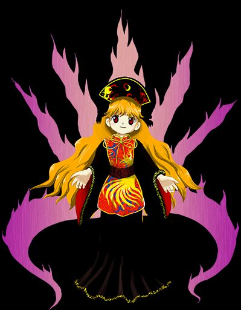

# 头部信息

1. 为什么会走红 + 维持热度
2. 国内二次元发展展望

演讲题目: 东方project——一个现象级 IP 的兴盛史

讲什么: 东方project，无论是在日本、中国还是世界范围内，都是一个非常有影响力的热门IP。截至2023年，其已经走过了20多年的发展历程，却依然保持有一定的热度。同时，其也与 “月姬” 和 “寒蝉鸣泣之时” 合称为 “三大同人奇迹” 之一。本次演讲想要分析的是，东方project，这样一个现象级的IP，到底是如何一步步地建立起来，并且能有如此持久的影响力和吸引力。

为什么讲: 本人出于东方 project 的兴趣，想要探究东方project为何会有如此强大的吸引力，以及为何其能够走红并且经久不衰，并希望能够为国内将来树立类似的热门IP指引一些方向，也希望能引发大家对于热点IP走红背后原因的思考。

如何讲: 本人计划从横向和纵向角度来分析东方project一步步走向热门的原因。纵向分析结合时代背景来进一步找出最初走向热门的原因，横向分析东方project独特的地方以及具有经久不衰的吸引力之处，最后希望能总结一些热门IP的产生和发展的规律。

# 思路区

重点: 世界观，

线索: 幻想乡，官方，二次创作

# 具体框架

## 引入

> 那是不知在何处、不知何时就存在的地方

> 在那里，人和精灵(其实是妖精)、鬼、妖怪等等不可思议的事物共存着

> 拥有众多力量，和不同目的的少女们，艰难摸索着来到了此处

> 温柔地包容着各种奇迹的那片大地……

> 它的名字是——

> “幻想乡”

(出自:[夜降り萃梦郷 ~ A Reverie of Dolls and Stellula](https://y.music.163.com/m/song?id=393858&uct=hWTVV82q2bU0EVvxZhm7IQ%3D%3D&dlt=0846&app_version=8.8.23&sc=wmv&tn=))

## 什么是东方project

则是东方 project 系列作品展开的场景。从前面这段简单的描述，我们不难看出，其似乎是一个充满神秘与幻想的世界。事实上，东方 project 系列作品就是建构这个叫做“幻想乡”的架空世界之上。

不仅如此，东方 project 也以其独特的同人文化而著名，成就了 “同人奇迹” 的美名。

需要特别注意的是，这里所谓的 “同人” 指的是志同道合的人，而对应的同人作品就是用来与志同道合的人分享的作品。而东方的同人作品最主要是对于 “原作” 的二次创作，作品涉及动画、小说、同人志、音乐、视频等各个方面。在本文中，二次创作和同人的概念在这里大体一致，实际上两者略有倾向，但是本文将会忽略两者之间的区别，可能会混用两个词。

(* 列数据(百度指数 google趋势 ~~luogu上车万题目~~ 其他游戏里致敬车万)，背景知识，理清一些基本概念，特别是车万人知道但是圈外人不知道的 )

[参考资料](https://thwiki.cc/ZUN/%E5%8C%97%E5%A4%A7%E6%BC%94%E8%AE%B2%E4%BC%9A)

keyword: 用户黏性；永恒性；

## 官方作品 (二次创作暂时没想好)

### 游戏主体形式

游戏形式:

弹幕 STG (**S**hoo**t**ing **G**ame)类游戏，基本规则是躲避敌方射来的子弹，并且要用自己射击的子弹去攻击敌方。

基本操作比较简单，涉及按键较少，不像某些游戏有大量按键，甚至是更加复杂的按键组合(例如MC)。不仅如此，东方系列游戏均有 Easy/Normal/Hard/Lunatic 由易到难四个难度梯度，以上两个因素使得新手能够很快的上手这款游戏。

游戏设定:

背景发生在幻想乡中的不同地方
每个角色有自己的能力
符卡制度

游戏特色:

不断迭代更新、新的尝试、不同风格的弹幕射击、创新性

- 符卡制度 # 伏笔 #
    在游戏中，每个角色都有自己的符卡，与角色的设定相符合。
    - 琪露诺 —— (立绘)冰 —— 冰符「Icicle Fall」（冰瀑）雹符「Hailstorm」（冰雹暴风）	
    - (**交给Hastin**)

- 非常具有挑战性
    尽管前面提到了东方系列的游戏基本操作简单易于上手，但这并不意味着其非常简单，即使是最简单的Easy难度也能难倒不少的入门玩家。

    > 就好比一个数学体系，只要有一些很基本的公理，就可以推导出一个复杂的系统。

    东方游戏考察的不是背诵那些繁杂的操作按键的能力，而要求的是玩家强大的 记忆规划 以及 动态处理 能力 。不仅如此，游戏采用了计分制度，为了获得更高的分数，玩家需更加高效率地利用游戏中的道具 和 机制，同时需要 高强度的专注力 以及 冷静的心态 ，当然也少不了大量反复练习 。

    (动态图 : 纯符 ，波与粒的境界 ，[link](https://www.bilibili.com/video/BV1as411m7au/) )

    --- (衔接 : 当然，从上面的这些弹幕中，我们不难看出 ...(兼具高挑战性以及艺术感) ）

- 弹幕非常美观 (运动轨迹 子弹形状多样(激光，各种形状) 配色符合人物 五颜六色)，并不是没有规律的随机弹幕 # 伏笔 #
    很多高难度的弹幕射击游戏，。。。(  **交给Hastin** )

- 几乎每张作品都有自己的特点
    - 永夜抄 : 背景是夜晚 —— 时间系统
    - 星莲船 : UFO  ——  收集飞碟 
    - 虹龙洞 : 卡牌 ——  收集卡牌获得技能

### 绘画 & 同人绘画

- 人物画风
    ZUN为他的游戏绘制的人物立绘被称为“ZUN绘”，
    不难看出，“Zun绘”有如下几个显著的特征。

    - 很可爱(即使是敌人) #伏笔#
        “Zun绘” 画风非常可爱,表情也非常丰富，而且人物神情非常平和慈祥，不会显得太具有攻击性，不会太具有压迫感，一定程度缓和了弹幕游戏的紧张气氛。

        在这里我们可以比较一下东方 project 游戏里面的立绘以及 xxx 游戏 ... 不难看出... 
        (*找一些其他游戏中敌人生气狰狞的图片作为对比)

- 服饰分析
    - 每个角色都有与之身份对应的服饰 #伏笔#
        从审美的眼光看，其画工实在令人难以恭维。然而在细节上，比如头发、衣饰、配件的设计与处理，ZUN又做得极其认真详细。每个人物都有其独特的、一目了然的标志物:谈到灵梦，就是红白蝴蝶结、巫女服，谈到魔理沙，就是金发、大魔女帽。这为之后的作品创作以及二次创作提供了详尽的指导。ZUN绘在角色设计这一功能上做得可谓完美。简而言之，所有服饰都是精心设计过的，而且并不是一成不变的。

        

        也正是因为以上这些特点，才使得Zun绘特别有标识度

        

        这张图列举了东方project中大部分的少女的立绘。

### 音乐 & 同人音乐

类似前面讲到的 “Zun绘” ，Zun编的曲子叫做“Zun曲”。

> ZUN做游戏是从音乐开始的，而其余诸如弹幕、人设、剧情等要素，都是在音乐的基础上添加进去的。也正因如此，东方才有数量如此庞大的同人音乐体系，可见音乐与东方文化密不可分。 
 
[copy](https://www.bilibili.com/read/cv535349/)

1.zun号
在东方stg作品中，几乎所有的原曲中都出现了小号，除了op和ed。甚至在以坟地为背景的神灵庙一作，zun依旧大量使用小号。这不仅和zun本人喜欢小号有关，更是因为小号的音色激烈、高亢，听起来振奋人心，与stg紧张刺激的频繁操作相得益彰，就像一刻不停的冲锋号一样让人越扭越兴奋。作为电子音源，通过处理减弱它尖锐的特性后，它的呆滞、不真实在zun曲里却化为了“悲”的特点，在磅礴且悲怆的曲子中大放异彩，例如《辉光之针的小人族》、《心之所向》。如果用真正的小号而非电子音源去演奏，就很难展现这一分悲伤。就像翻唱版本的活动小丑和miku音源原版的相比，真实歌者在歌声中就算揉进了全身的悲情，也不如电子音那麻木的嗓音更让人心疼。zun号的魔性，主要在于出现频率高、万金油的属性，和zun对这一个音源出神入化的不同调整，使之适用于不同曲子。作曲新手也可以选一个自己最喜欢的乐器，尝试大量使用，并从中练习音源参数设定。

2.zun式停顿
大家都知道东方stg原曲都是要循环播放的，然而用小号或转调把曲子推倒了高潮部分，怎么才能再回到刚开始的低谷让它能循环起来呢？zun法是把所有旋律乐器都停两个小节，只留鼓继续演奏，最多再加个bass。其实这种停顿非zun曲特有，这是多乐段游戏音乐常用的衔接方式。例如传说之下中sans战bgm《megalovania》的一段，同样是停掉了其他旋律乐器只留鼓和bass。这是因为鼓和bass作为乐曲节奏的定位针，就算没有旋律也可以延续曲子的基本情绪，如同广场舞只需要动次打次就能进行。虽然这种转折有些突兀，但比再写一个新乐段去连接前后更加方便。而且在节奏紧张的游戏中，玩家也难以发觉bgm的循环。总的来说，“zun式停顿”非zun曲专有，而是需要循环播放的游戏音乐常用、好用的简单方法。

3.zun鼓
电子乐中的鼓点作为旋律的陪衬，乐曲节奏的定位针，作用十分重要。写鼓这门本事只可意会不可言传，是要根据具体旋律和意境，去具体创作的。我觉得zun曲中的鼓有两点规律可以总结和学习：①用密集的鼓点起势。例如《少女幻葬》一曲，出现了许多一串密集的、听起来“秃噜”一下的鼓点，预示着“我又要开始搞起了”、“我还要接着搞起”、“我要变了”②鼓点排列富于变化。有词的歌曲中，鼓不能太花哨以免喧宾夺主；没有词的纯音乐则相反，鼓点循环周期要长，否则会显得单调乏味、可有可无。zun鼓听着舒服又难以分析就是因为这点，几乎都是以一个乐句为一个周期。鼓的排列和频率要富于变化，但音源种类要少选，强拍上使用的音源要选穿透力强的且统一在三种以内。
zun鼓还有其他特点，与架子鼓、penbeat的特点相近。在写鼓的时候，要意识到电子乐可以轻松做到人类无法完成的操作。以“用电脑超越人类”为目标写鼓，大概就能写得像zun一样了吧。

编曲和游戏环境精密相连，情绪被调动。曲子本身艺术上有一定的造诣，旋律线条非常突出（zun号）（音乐片段 + 乐评（找ycx 或者 其他业界大佬的话））（reference:

[从zun曲的特点中学习作曲技巧【东方吧】_百度贴吧 (baidu.com)](https://tieba.baidu.com/p/5689827990)

### 幻想乡世界

#### 官方游戏之外的设定

- 不止于游戏，还有各种相关文档。

> 游戏文档、官方出版物的补充使得角色们有血有肉了起来。从她们的言谈举止、别人的描述看法中，人物形象明晰浮现，烙印在每个粉丝心中，而不再是呆板灰暗的量产 “平面人” 。吸引人的活的角色！怎么不让人浮想联翩 ?

[从这里超的](https://zhuanlan.zhihu.com/p/36740397)

#### 角色塑造

(与角色绘画 + 音乐提到的鲜明突出的特点相结合)

纯女性 二次元

矛盾 对立 制造冲击力 

玩家在游戏的化身是角色 (间离效应)

角色塑造的非常特色 -> 整合性

扁平 ~ 立体 -> 二次创作的空间

> 从 bad apple!! 中人物剪影，每个人物有自己鲜明的特点。

#### 文化因素

大量日本传统(神社，竹取等等)。

西方元素(吸血鬼) +  + 中国传统（霍青娥） + 宗教 (cautious part，有争议) 等等。

#### 二次创作

#### 幻想乡背景 世界观

时代错位

心中的桃花源:

1. 远离外界，是一个与现实世界平行存在的世界。
2. 没有死亡(妖精可以复活)，异变解决后依然众人能保持很好的关系，甚至
3. 

(Reference: [(4 条消息) 东方 Project 文化的根本精神或是内核是什么？ - 知乎 (zhihu.com)](https://www.zhihu.com/question/482243588/answer/2083561968 "https://www.zhihu.com/question/482243588/answer/2083561968") )

总结：宏大的幻想世界，数以百计各有特色的角色特点，融合了东西方的文化（文化包容性）

### 官方对于同人的态度 + 同人二次创作

[同人守则](https://www.bilibili.com/read/cv6364137)

keyword: 鼓励二次创作

二次创作开放性 + 商业化规矩性 （最重要）

对比商业模式reference : (

[为什么知道东方 Project 的人这么少？ - 知乎 (zhihu.com)](https://www.zhihu.com/question/312778043/answer/603442465 "https://www.zhihu.com/question/312778043/answer/603442465")

[同人创作与商业化的关系 ——论商业化对同人创作内容的影响 - 知乎 (zhihu.com)](https://zhuanlan.zhihu.com/p/66682612 "https://zhuanlan.zhihu.com/p/66682612")

## 环境因素(历史，地理)

1. 日本本身同人/ACG环境好
    - 宽松教育 https://www.zhihu.com/question/306303516

2. 东方project 赶上了 2007 年的一波互联网热潮 (niconico)　Bad Apple!! 大火

3. 东方社区的正向反馈(滚雪球效应)

## 待定

国内 IP 发展:
未来展望: https://zhuanlan.zhihu.com/p/36740397

# reference

未分类(请帮我添加thx):

(文化学刊)
https://www.zhihu.com/column/touhou-culture-studies

<!-- https://zhuanlan.zhihu.com/p/36830268 -->

https://zhuanlan.zhihu.com/Gensokyo-in-Zhihu

https://zhuanlan.zhihu.com/p/36182564